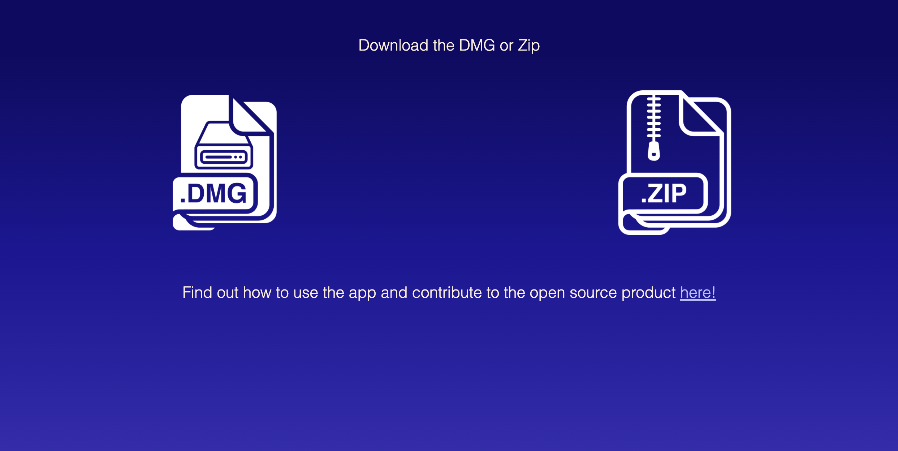
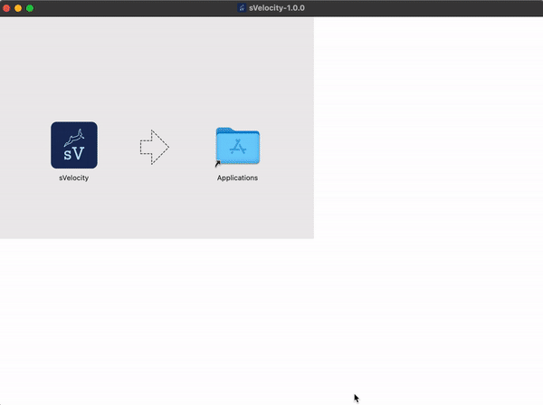
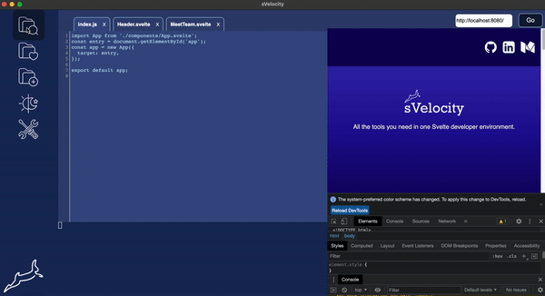
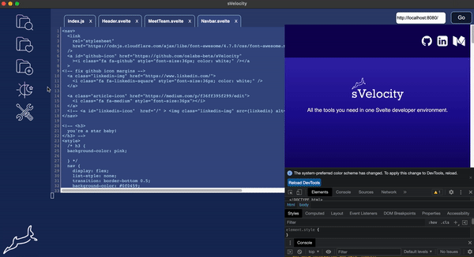
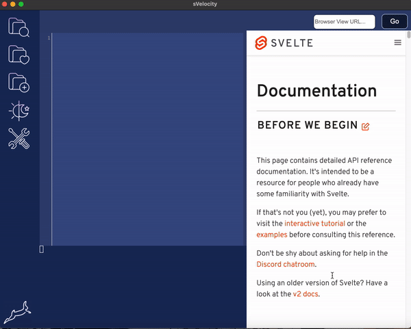
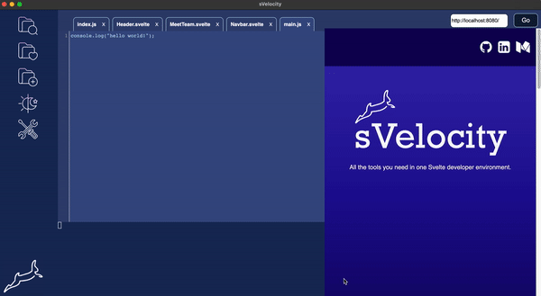
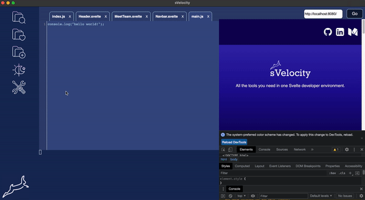

<p align="center"><a href='http://svelocity.io/'></a></p>

### sVelocity is a dedicated IDE for Svelte web application development.

sVelocity is a cross-platform code editor application optimized for building and debugging modern Svelte applications. sVelocity is free and build on open source.

#### sVelocity is in active development. Please follow this repo for contribution guidelines and road map.

## Table of Contents

- [Table of Contents](#table-of-contents)
- [sVelocity App Installation](#svelocity-app-installation)
- [How to use](#how-to-use)
- [Built With](#built-with)
- [Features](#features)
- [Upcoming Features](#upcoming-features)
- [Contributions Welcome](#contributions-welcome)
- [License](#license)
- [Contributors](#contributors)

## sVelocity App Installation

The sVelocity IDE can be set up in two ways, the first is to bundle the electron app and run it as a native desktop App. The instructions are as follows:

Installation step 1:

```
Visit the SVelocity Official website to download the app.
```

<p align="center">
  
</p>

Installation step 2:

```
Open the app and give access permissions.
```



<!-- ## sVelocity App Installation #2

1. go to your terminal and type the following:

```
TBD
``` -->

## How to use

Open a file in the editor



Create a new file



Save your work

Files can be saved by clicking the save button.

Connect to the Browserview



Use the devtools with the Browserview



Toggle dark-mode



## Built With

- Javascript ES6
- Node.js
- XTerm.js
- Electron
- Codemirror Code Editor
- Electron-Store
- Electron-Builder

## Features

- A code editor to give users the ability to build out their components
- An integrated terminal to run their project's code
- A browser view to monitor the user's projects
- Browser view's dev tools to debug their code within sVelocity
- Form to view any url in browser view.
- Tab features
- Dark mode capability

## Upcoming Features

- A file directory to open their files and folders as tabs in the app
- A component tree to visualize state and the flow of the user's application
- Linter and spell-check features
- Allow components to be draggable with mouse.

## Contributions Welcome

We are always happy to receive feedback and ideas on how to improve. Please feel free to make a PR with your suggestions and one of the developer team members will get in touch as soon as possible.

## License

sVelocity is MIT licensed.

## Contributors

[Tehya Rassman](https://github.com/tehyaarassman) | [Eleni Zoumpoulaki](https://github.com/elenizoump) | [Allie Marzieh](https://github.com/AllieMarzieh) | [Justin Blalock](https://github.com/jmblalock)
